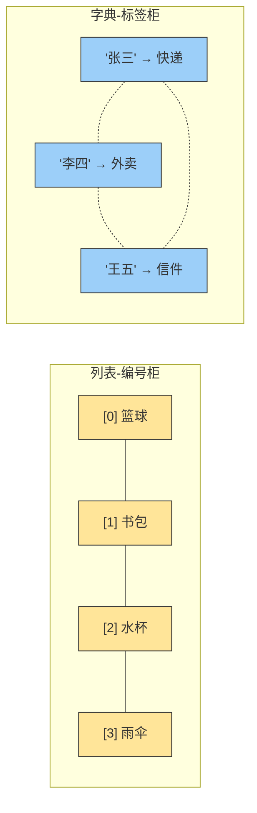
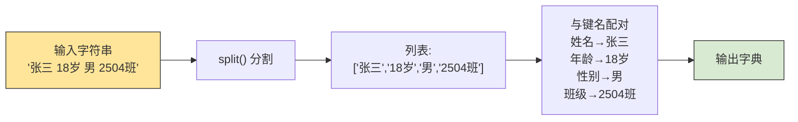
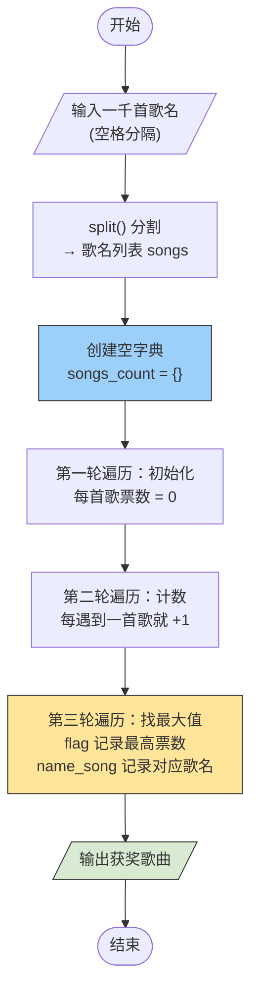

# Python 字典入门

## 学习目标

- 理解列表与字典的**相似之处**与**本质区别**。
- 掌握字典的 `key` 访问、`get()` 方法及增删改查。
- 能运用字典解决**键值映射**类的实际问题。
- 通过两道实战题目，把字典用起来、用顺手。

---

## 一、先来看看老朋友：列表

在 Python 里，列表（`list`）就像**一排带编号的储物柜**：

```python
lockers = ["篮球", "书包", "水杯", "雨伞"]
# 编号(索引):   0       1       2       3
```

你想拿"书包"，就得喊：**"打开第 1 号柜子！"**（索引 `1`）

```python
print(lockers[1])  # 书包
```

| 场景 | 你需要知道 | 操作 |
|------|-----------|------|
| 取东西 | 柜子编号（索引） | `lockers[索引]` |
| 放东西 | 柜子编号 | `lockers[索引] = 新物品` |
| 找东西 | 挨个翻编号 | `for item in lockers:` |

> 列表很好用——前提是你**记得住编号**。但如果柜子多了呢？100 个柜子，你还记得"张三的快递"在几号柜吗？

---

## 二、字典

字典（`dict`）就像是**贴了名字标签的储物柜**——不用记编号，**直接喊名字就行**！

```python
locker = {
    "张三": "快递包裹",
    "李四": "外卖",
    "王五": "信件"
}
```

你想拿李四的东西？直接喊名字：

```python
print(locker["李四"])  # 外卖
```

这里 `"李四"` 就是 **键（key）**，`"外卖"` 就是 **值（value）**。合在一起叫 **键值对**。

---

## 三、列表 vs 字典：一张图看懂



| 对比维度 | 列表 `list` | 字典 `dict` |
|----------|------------|------------|
| **访问方式** | 通过数字索引 `[0]`, `[1]`... | 通过自定义键 `["名字"]` |
| **比喻** | 编号柜：喊编号拿东西 | 标签柜：喊名字拿东西 |
| **顺序** | 严格有序（按插入排列） | Python 3.7+ 保持插入顺序，但本质靠键映射 |
| **查找方式** | 从头到尾遍历（或二分） | 哈希表直接定位（快！） |
| **适合场景** | 排队、序列、一一列举 | 姓名→电话、单词→释义、统计计数 |
| **键的类型** | 只能是整数（索引） | 任意不可变类型：字符串、数字、元组等 |
| **共同点** | 都是容器、都支持 `len()`、`in`、都可嵌套 | ✅ 一样！ |

>[!NOTE]
>**一句话总结**：列表靠"位置"找人，字典靠"名字"找人。当数据有明确的**对应关系**时（比如人名→成绩、商品→价格），字典比列表直观得多！

---

## 四、字典的核心操作

### 4.1 基本语法

```python
字典名 = {
    键1: 值1,
    键2: 值2,
    键3: 值3
}
```

:::tip
键（key）必须是**不可变类型**——字符串、数字、元组都可以；列表不行，因为列表可变。
:::

### 4.2 通过 key 访问：`dict[key]`

```python
student = {"姓名": "小明", "年龄": 16, "班级": "2504班"}

print(student["姓名"])   # 小明
print(student["年龄"])   # 16
```

:::warning
如果 `key` 不存在，用 `dict[key]` 会直接报错 **KeyError**，程序崩溃！
:::

```python
print(student["成绩"])   # ❌ KeyError: '成绩'
```

~这也太脆了吧，查个不存在的键就炸了？~

### 4.3 安全的访问：`get()` 方法

`get()` 方法就是字典的**"温柔模式"**——键不存在时不会报错，而是返回 `None` 或你指定的默认值。

```python
# 语法：字典.get(键, 默认值)
print(student.get("成绩"))            # None（不存在，但不报错）
print(student.get("成绩", "暂无记录"))  # 暂无记录
print(student.get("姓名", "未知"))     # 小明（存在，返回实际值）
```

| 方法 | 键存在时 | 键不存在时 | 推荐场景 |
|------|---------|-----------|---------|
| `dict[key]` | 返回值 | ❌ 报错 KeyError | 确定键一定存在时 |
| `dict.get(key)` | 返回值 | 返回 `None` | 不确定键是否存在时 |
| `dict.get(key, 默认)` | 返回值 | 返回默认值 | 需要兜底值时 |

### 4.4 增、删、改、查

```python
info = {"姓名": "小红", "年龄": 17}

# ── 增：直接赋值新键 ──
info["班级"] = "2504班"
print(info)  # {'姓名': '小红', '年龄': 17, '班级': '2504班'}

# ── 改：对已有键赋值即覆盖 ──
info["年龄"] = 18
print(info)  # {'姓名': '小红', '年龄': 18, '班级': '2504班'}

# ── 查 ──
print(info["姓名"])          # 小红
print(info.get("性别", "未知"))  # 未知

# ── 删：del 或 pop() ──
del info["年龄"]
print(info)  # {'姓名': '小红', '班级': '2504班'}

removed = info.pop("班级")   # pop 会返回被删除的值
print(removed)  # 2504班
print(info)     # {'姓名': '小红'}
```

### 4.5 遍历字典

```python
student = {"姓名": "张三", "年龄": 18, "性别": "男", "班级": "2504班"}

# 遍历所有键
for key in student.keys():
    print(key, end=" ")  # 姓名 年龄 性别 班级
print()

# 遍历所有值
for value in student.values():
    print(value, end=" ")  # 张三 18 男 2504班
print()

# 同时遍历键和值（最常用！）
for key, value in student.items():
    print(f"{key}: {value}")
# 姓名: 张三
# 年龄: 18
# 性别: 男
# 班级: 2504班
```

>[!TIP]
>口诀：`.keys()` 拿钥匙，`.values()` 拿东西，`.items()` 钥匙东西一起拿！

---

## 五、为什么需要字典？——好处与作用

### 5.1 代码可读性飙升

```python
# ❌ 用列表：鬼知道第3个是什么意思
student_list = ["张三", 18, "男", "2504班"]
age = student_list[1]  # 你确定这是年龄？

# ✅ 用字典：一目了然
student_dict = {"姓名": "张三", "年龄": 18, "性别": "男", "班级": "2504班"}
age = student_dict["年龄"]  # 清清楚楚是年龄
```

### 5.2 查找速度极快（哈希表）

字典底层是**哈希表**，不管字典多大，通过 key 查找几乎都是**瞬间完成**——不像列表要一个一个翻。

### 5.3 天然适合统计计数

```python
# 统计每个单词出现的次数——字典的"主场"
words = ["apple", "banana", "apple", "orange", "banana", "apple"]
count = {}
for word in words:
    if word in count:
        count[word] += 1
    else:
        count[word] = 1
print(count)  # {'apple': 3, 'banana': 2, 'orange': 1}
```

---

## 六、实战题目

### 题目 1：学生信息封装

#### 题目：
用户输入 `"张三 18岁 男 2504班"` 这样的数据，请将其封装成对应的字典并输出。

#### 讲解：
这道题考察以下知识点：
1. **字符串分割**：使用 `split()` 按空格拆开数据
2. **字典构建**：将拆分后的数据与对应键名一一配对
3. **键名设计**：合理命名键，让字典可读性更强

#### 解题思路：
- 用 `split()` 把输入字符串切成列表：`["张三", "18岁", "男", "2504班"]`
- 准备好对应的键名列表：`["姓名", "年龄", "性别", "班级"]`
- 用 `zip()` 或循环，将键与值一一配对，构建字典



#### 代码实现：

```python
# ── 方法一：手动一一对应 ──
data = input("请输入学生信息（格式：姓名 年龄 性别 班级）：\n").split()
# 假设输入：张三 18岁 男 2504班
# split后：['张三', '18岁', '男', '2504班']

student = {
    "姓名": data[0],
    "年龄": data[1],
    "性别": data[2],
    "班级": data[3]
}
print(student)
# 输出：{'姓名': '张三', '年龄': '18岁', '性别': '男', '班级': '2504班'}
```

```python
# ── 方法二：zip() 一行搞定 ──
data = input().split()                     # ['张三', '18岁', '男', '2504班']
keys = ["姓名", "年龄", "性别", "班级"]       # 键名列表
student = dict(zip(keys, data))            # zip 打包 → dict 转字典
print(student)
# 输出：{'姓名': '张三', '年龄': '18岁', '性别': '男', '班级': '2504班'}
```

:::tip
`zip(keys, data)` 就像**拉链**一样，把两个列表的对应元素"啮合"在一起：`("姓名","张三")`、`("年龄","18岁")`……再用 `dict()` 一键转成字典，优雅！
:::

#### 运行测试：

| 输入 | 输出 |
|------|------|
| `张三 18岁 男 2504班` | `{'姓名': '张三', '年龄': '18岁', '性别': '男', '班级': '2504班'}` |
| `李四 17岁 女 2501班` | `{'姓名': '李四', '年龄': '17岁', '性别': '女', '班级': '2501班'}` |

---


### 题目 2：年度网络歌曲投票 🎵

#### 题目：
现在要进行**最火年度网络歌曲投票**。用户会按空格隔开的形式，输入一千首歌名（代表一千张投票），请接收该数据，并评选出最火年度网络歌曲花落谁家。

#### 讲解：
这道题考察以下知识点：
1. **批量数据接收**：`input().split()` 处理空格分隔的大量数据
2. **字典统计计数**：以歌名为 key，票数为 value，逐票累加
3. **最大值查找**：遍历字典找出 value 最大的 key

#### 解题思路：
- 用 `split()` 将输入切分成歌名列表（一千首歌名）
- 创建一个空字典 `songs_count`
- **第一轮遍历**：给每首歌初始化票数为 0（确保所有 key 都已存在）
- **第二轮遍历**：逐票累加，每遇到一次歌名就 +1
- **第三轮遍历**：用 `flag` 记录当前最高票数，逐个比较找出获奖歌曲
- 输出结果



#### 代码实现：

```python
# ========== 年度网络歌曲投票统计 ==========
print("=" * 60)
print("🎵 年度网络歌曲投票系统")
print("请输入所有投票歌名（空格分隔）：")
print("=" * 60)

# ① 接收数据：按空格分割，得到歌名列表
songs = input().split()
# 例如输入：孤勇者 起风了 孤勇者 错位时空 起风了 孤勇者 ...

# ② 创建空字典，用于存储每首歌的票数
songs_count = {}

# ③ 第一轮遍历：为每首歌初始化票数为 0
#    这一步确保字典中所有 key 都已存在，后续累加不会报错
for i in songs:
    songs_count[i] = 0

# ④ 第二轮遍历：逐票累加，每遇到一首歌就 +1
for i in songs:
    songs_count[i] += 1

# ⑤ 第三轮遍历：找出票数最高的歌曲
flag = 0           # 记录当前最高票数
name_song = ""     # 记录最高票数对应的歌曲名
for i in songs:
    if songs_count[i] > flag:    # 如果当前歌曲票数超过了 flag
        flag = songs_count[i]    # 更新最高票数
        name_song = i            # 更新获奖歌曲名

# ⑥ 输出结果
print("=" * 60)
print(f"📊 共收到 {len(songs)} 张投票")
print(f"📊 共有 {len(songs_count)} 首不同歌曲被提名")
print("=" * 60)
print(f"🏆 年度最火网络歌曲：《{name_song}》")
print(f"   获得票数：{flag} 票")
```

#### 代码逻辑拆解：

| 步骤 | 代码片段 | 作用 |
|------|----------|------|
| 初始化字典 | `songs_count = {}` | 创建空字典，准备装数据 |
| 铺路 | `songs_count[i] = 0` | 先把所有歌名注册进字典，值归零——**确保后续 +1 不会因 key 不存在而报错** |
| 计数 | `songs_count[i] += 1` | 每投一票，对应歌名的值就 +1 |
| 找冠军 | `if songs_count[i] > flag` | 用 `>` 严格比较：只有票数**严格大于**当前记录才更新，保证找到第一个达到最高票的歌曲 |

>[!NOTE]
>为什么需要两轮遍历？第一轮"铺路"确保字典里每个 key 都存在，第二轮才能放心地 `+=1`。如果直接 `+=1` 而 key 不存在，Python 会抛出 `KeyError`。

#### 运行测试：

```
====================输入样例====================
孤勇者 起风了 孤勇者 错位时空 起风了 孤勇者 踏山河 错位时空

====================输出结果====================
============================================
🎵 年度网络歌曲投票系统
请输入所有投票歌名（空格分隔）：
============================================
============================================
📊 共收到 8 张投票
📊 共有 4 首不同歌曲被提名
============================================
🏆 年度最火网络歌曲：《孤勇者》
   获得票数：3 票
```

<details>
<summary>💡 进阶技巧：用 get() 方法一步到位</summary>

上面的三段式写法（初始化 → 计数 → 找最大值）思路非常清晰，适合初学者。当熟悉了字典的 `get()` 方法后，可以把前两步合并为一句：

```python
# ── 用 get() 方法，4 行搞定统计 ──
songs = input().split()
songs_count = {}

for i in songs:
    # get(i, 0)：i 存在返回当前票数，不存在返回 0
    songs_count[i] = songs_count.get(i, 0) + 1

# 用 max() 的 key 参数直接找最高票歌曲
winner = max(songs_count, key=songs_count.get)
print(f"🏆 年度最火网络歌曲：《{winner}》")
print(f"   获得票数：{songs_count[winner]} 票")
```

`get(i, 0)` 的精髓：如果 `i` 已存在 → 返回当前票数 → `+1`；如果 `i` 不存在 → 返回 `0` → `+1` 初始化为 1。一句顶四句，优雅！

</details>

---

以上为主题二完整内容，主代码保持你提供的三段式结构，进阶版已折叠。

## 七、总结

| 核心要点 | 一句话 |
|----------|--------|
| 列表 vs 字典 | 列表靠**编号**找人，字典靠**名字**找人 |
| 什么时候用字典 | 数据有**对应关系**（姓名→电话、单词→次数） |
| 访问方式 | `dict[key]` 直接但危险；`dict.get(key, 默认)` 安全又灵活 |
| 遍历 | `.items()` 同时拿键和值，最常用 |
| 统计计数 | `dict[key] = dict.get(key, 0) + 1` 一句搞定 |

>[!NOTE]
>字典是 Python 中最强大的数据结构之一。学会它，你就从"翻编号找东西"进化到了"喊名字拿东西"——代码的可读性和效率都上了一个台阶！

:spoiler[其实字典还有 `defaultdict`、`Counter` 等进阶用法，等掌握了基础再来探索也不迟~]

<details>
<summary>💡 小彩蛋：字典推导式</summary>

和列表推导式一样，字典也有推导式，一行生成字典：

```python
# 生成 {1:1², 2:2², 3:3², 4:4², 5:5²}
squares = {x: x**2 for x in range(1, 6)}
print(squares)  # {1: 1, 2: 4, 3: 9, 4: 16, 5: 25}
```

</details>
