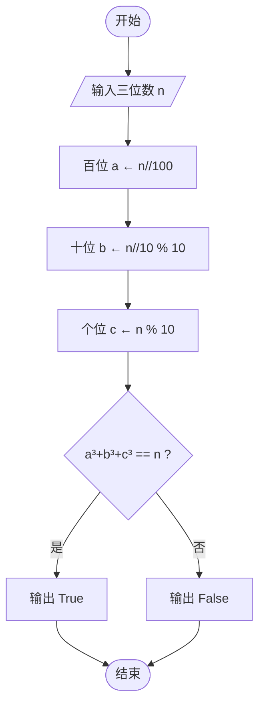

# Python解题思路讲解
## 一、水仙花计数判断
### 1. 读懂题目
**题目：**
输入一个三位数，判断这个三位数是否是水仙花数，所谓水仙花数是指一个三位数，其各位数字⽴方和等于该数本身。例如:153是⼀个⽔仙花数,因为 1³ + 5³ + 3³ 等于 153
**首先我们得拆解题意**
* 题目需要有输入/输入
* 题目需要判断
* 题目需要计算
### 2. 拆解题意
先把题目拆成“三件小事”：  
1. 拿到一个三位数 → 输入  
2. 把它的百、十、个位分别拎出来 → 计算  
3. 看看立方和等不等于它本身 → 判断  
   
| 输入  | 计算过程                  | 期望输出 |
| --- | --------------------- | ---- |
| 153 | 1³+5³+3³=1+125+27=153 | 是    |
| 120 | 1³+2³+0³=1+8+0=9 ≠120 | 否    |
| 371 | 3³+7³+1³=27+343+1=371 | 是    |
>[!NOTE]
小结：只要“立方和 == 原数”就是水仙花数，代码里对应一个 `if` 判断。
>
**可得：**
* 有`input`赋值
* 有`if`语句判断
* 需要对计算结果进行判断，计算公式为1^3 + 5^3 + 3^3 = x
>[!TIP] 
一句话口诀  
 输入 → 拆位 → 立方和 → if 判断 → 输出 True/False
>
### 3. 逻辑梳理
为了更清楚的了解流程,以下是流程图：

### 4. 编写代码
由上面的流程图可得：
```python
n = int(input())          
a = n // 100              # 百位
b = (n // 10) % 10        # 十位
c = n % 10                # 个位
if a**3 + b**3 + c**3 == n:
    print("True")         # 题目要求输出 True/False 也行
else:
    print("False")
```
运行结果测试：
| 手工输入   | 屏幕输出    | 说明        |
| ------ | ------- | --------- |
| `153`↵ | `True`  | 153 是水仙花数 |
| `120`↵ | `False` | 120 不是    |
| `371`↵ | `True`  | 371 是水仙花数 |
### 小结
你知道吗？三位数中只有 4 个水仙花数：153、370、371、407。你可以试试输入它们，看看是不是都输出 True！