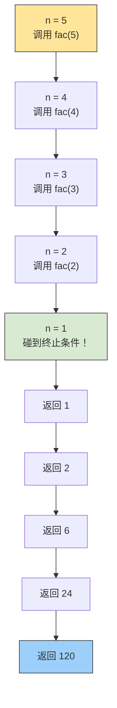
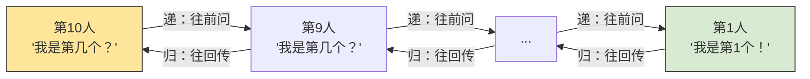
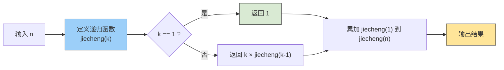
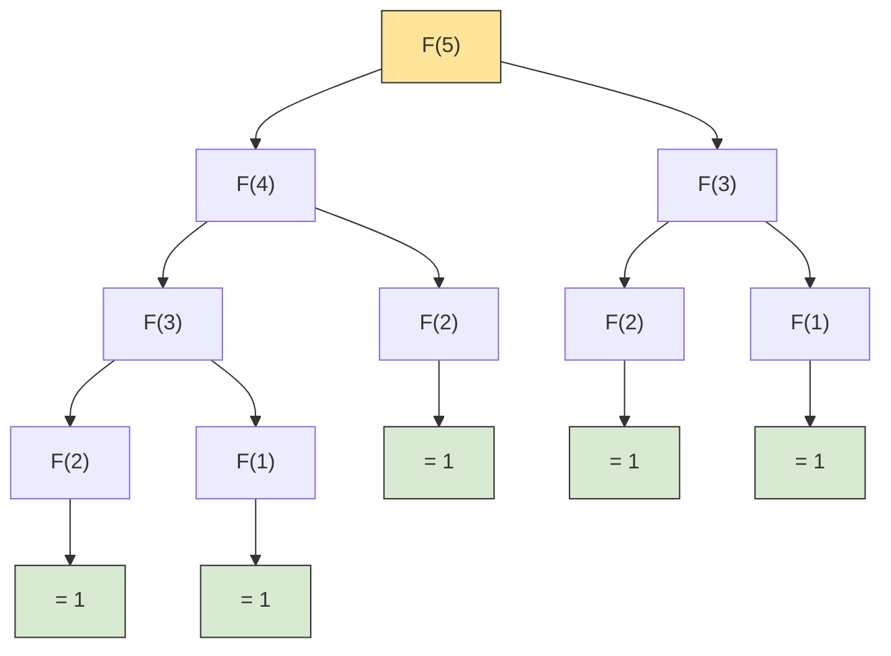

# Python 递归入门

## 学习目标

- 理解递归的核心思想：**自己调用自己**
- 掌握递归三要素：**终止条件**、**递归关系**、**递归调用**
- 能通过递归解决**阶乘**和**斐波那契数列**等经典问题
- 了解递归的优缺点，知道什么时候该用、什么时候不该用

---

## 一、什么是递归？

想象你站在两面相对的镜子之间，会看到**无穷无尽的镜像**。这就是递归的直观感受：**一个函数在内部调用它自己**。



>[!NOTE]
>递归的精髓就一句话：**把大问题拆成同类型的小问题，拆到不能再拆为止。**

---

## 二、递归的三要素

写对递归，必须把下面三件事想清楚：

| 要素 | 含义 | 以阶乘为例 |
|------|------|-----------|
| **① 终止条件（base case）** | 什么时候停下来？ | `n == 1` 时返回 `1` |
| **② 递归关系（recurrence）** | 大问题和小问题是什么关系？ | `fac(n) = n × fac(n-1)` |
| **③ 递归调用（recursive call）** | 怎么用更小的参数调用自己？ | `return n * fac(n-1)` |

:::warning
**忘记终止条件 = 无限递归 → 栈溢出 → 程序崩溃！**
:::


---

## 递归，到底"递"了什么，"归"了什么？

把"递归"两个字拆开看：

- **递**：把问题**传递**下去—— "我算不出来，但我可以把问题缩小一号，交给下一个我"
- **归**：把答案**归还**上来—— "最底层的我算出来了，一层一层把结果传回去"

打个比方：你排在一列长队的最后面，想知道自己是第几个人。你不会从头数，而是——

> 拍前面人的肩膀："嘿，你是第几个？"
> 前面的人也不知道，他又拍更前面的人……
> 一直传到第一个人："我是第 1 个！"
> 然后答案一路往回传："我是第 2 个" → "我是第 3 个" → …… → "你是第 10 个！"



这个排队问人的过程，就是递归——

| 排队场景 | 对应递归 |
|----------|----------|
| "你是第几个？" | **函数调用自己** |
| 第一个人说"我是第1个" | **终止条件（base case）** |
| "我是前面那个的编号 +1" | **递归关系** |
| 一路往回传答案 | **返回值逐层弹栈** |

>[!NOTE]
>所以递归就两件事：**把还没解决的问题继续算下去**，再**把条件符合的结果返回出来**。

---

<details>
<summary>💡 选看：递归的底层原理——调用栈</summary>

每次函数调用，Python 都会在**调用栈**上压入一个"栈帧"，记录函数的局部变量和返回地址。递归本质上就是把栈帧一层一层叠上去，触底（终止条件）后再一层一层弹回来。

```python
# 用一个简单例子观察调用栈
def countdown(n):
    print(f"进入 countdown({n})")   # ← 压栈时打印
    if n <= 0:
        return
    countdown(n - 1)
    print(f"退出 countdown({n})")   # ← 弹栈时打印

countdown(3)
```

```
进入 countdown(3)
进入 countdown(2)
进入 countdown(1)
进入 countdown(0)
退出 countdown(1)
退出 countdown(2)
退出 countdown(3)
```

>[!TIP]
>从输出可以看到：**先进入的后退出**（后进先出），这就是调用栈的工作方式。

</details>

---

## 三、实战题目

### 题目 1：计算阶乘和（1! + 2! + … + n!）

#### 题目：
用户输入一个正整数 `n`，计算 `1! + 2! + 3! + … + n!` 的值并输出。

#### 讲解：
这道题可以分为两步：
1. **写一个递归函数计算阶乘**：`jiecheng(n)`
2. **累加 1 到 n 的阶乘**：`jiecheng(1) + jiecheng(2) + ... + jiecheng(n)`

**阶乘的递归关系：**

$$
n! = \begin{cases}
1 & (n = 1) \\
n \times (n-1)! & (n > 1)
\end{cases}
$$

#### 解题思路：



#### 代码实现：

```python
# ── 递归版：求 n 的阶乘 ──
def jiecheng(n):
    if n == 1:              # 终止条件：1! = 1
        return 1
    return n * jiecheng(n - 1)  # 递归关系：n! = n × (n-1)!

# ── 累加 1! 到 n! ──
n = int(input(""))
k = 0

for j in range(1, n + 1):
    k += jiecheng(j)
print(k)
```

| 变量 | 作用 |
|------|------|
| `jiecheng(n)` | 递归计算 `n!` |
| `k` | 累加器，存放最终的和 |
| `range(1, n+1)` | 从 1 遍历到 n，逐个累加阶乘 |

#### 运行测试：

| 输入 | 计算过程 | 输出 |
|------|---------|------|
| `3` | 1! + 2! + 3! = 1 + 2 + 6 | `9` |
| `5` | 1! + 2! + 3! + 4! + 5! = 1 + 2 + 6 + 24 + 120 | `153` |

---

### 题目 2：递归计算斐波那契数列第 n 项

#### 题目：
使用递归计算斐波那契数列的**第 20 个数字**。

#### 讲解：

斐波那契数列的定义：

$$
F(n) = \begin{cases}
1 & (n = 1 \text{ 或 } n = 2) \\
F(n-1) + F(n-2) & (n > 2)
\end{cases}
$$

数列的前几项：`1, 1, 2, 3, 5, 8, 13, 21, 34, 55, ...`

斐波那契数列是递归的**天然例题**——因为它的定义本身就是递归的：每一项等于前两项之和。



>[!NOTE]
>从图中可以看到，`F(3)` 被重复计算了两次，`F(2)` 被计算了三次。这也是递归求斐波那契的**效率缺陷**：**大量重复计算**。

#### 解题思路：

- 三要素分析：
  - **终止条件**：`n == 1` 或 `n == 2` → 返回 `1`
  - **递归关系**：`F(n) = F(n-1) + F(n-2)`
  - **递归调用**：`return feibo(n-1) + feibo(n-2)`

#### 代码实现：

```python
# ── 递归版：求斐波那契数列第 n 项 ──
def feibo(n):
    if n == 1 or n == 2:         # 终止条件
        return 1
    return feibo(n - 1) + feibo(n - 2)  # 递归关系

print(feibo(20))
```

#### 运行结果：

```
6765
```

| 输入 | 含义 | 输出 |
|------|------|------|
| `feibo(1)` | 第 1 项 | `1` |
| `feibo(2)` | 第 2 项 | `1` |
| `feibo(10)` | 第 10 项 | `55` |
| `feibo(20)` | 第 20 项 | `6765` |

---

## 四、递归 vs 循环：什么时候用递归？

| 对比维度 | 递归 | 循环 |
|----------|------|------|
| **代码简洁度** | 简洁、接近数学定义 | 通常代码更长 |
| **内存占用** | 每次调用占一个栈帧，可能栈溢出 | 只用一个循环体，内存开销小 |
| **执行速度** | 函数调用有开销，略慢 | 直接循环，更快 |
| **适合场景** | 树遍历、分治、回溯、数学归纳 | 简单重复操作、线性迭代 |

:::tip
**判断标准**：如果问题天然是"自相似"的（一棵树由子树构成、一个图由子图构成），用递归更自然。如果只是简单的"做 N 次"循环，用 `for`/`while` 更高效。
:::

~斐波那契用递归来计算第 20 项已经要调用 13529 次函数了，求第 50 项怕不是要等到天荒地老……~

<details>
<summary>💡 进阶：用记忆化优化斐波那契</summary>

递归求斐波那契最大的问题是**重复计算**。用一个字典把算过的结果存起来，下次遇到直接取，效率就能从指数级降到线性级：

```python
# ── 记忆化递归：用字典缓存已计算结果 ──
cache = {}

def feibo(n):
    if n in cache:           # 算过了，直接返回
        return cache[n]
    if n == 1 or n == 2:
        result = 1
    else:
        result = feibo(n - 1) + feibo(n - 2)
    cache[n] = result        # 存入缓存
    return result

print(feibo(20))  # 6765，但这次快得多
print(feibo(50))  # 12586269025，瞬间出结果
```

这就是**记忆化搜索**，也叫**自顶向下的动态规划**——是递归进阶的重要技巧！

</details>

---

## 五、总结

| 核心要点 | 一句话 |
|----------|--------|
| 什么是递归 | 函数自己调用自己，把大问题拆成小问题 |
| 递归三要素 | 终止条件 + 递归关系 + 递归调用，缺一不可 |
| 调用栈 | 先进后出，终止条件触底后逐层返回 |
| 阶乘递归 | `n! = n × (n-1)!`，终止于 `1` |
| 斐波那契递归 | `F(n) = F(n-1) + F(n-2)`，终止于 `F(1)=F(2)=1` |
| 什么时候用 | 问题天然是"自相似"结构时用递归，简单重复用循环 |

>[!NOTE]
>递归是计算机科学中最优美的思想之一。从树的遍历到图的搜索，从分治算法到回溯算法，无处不在,赞美递归

::spoiler[爆栈的时候除外]