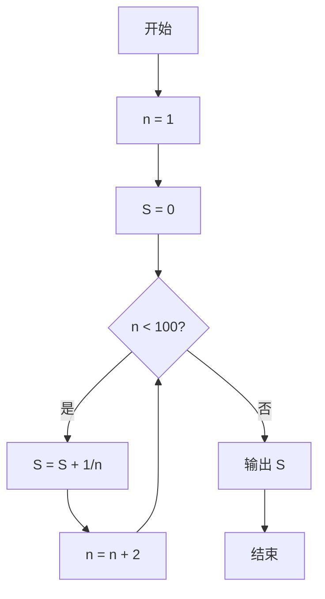
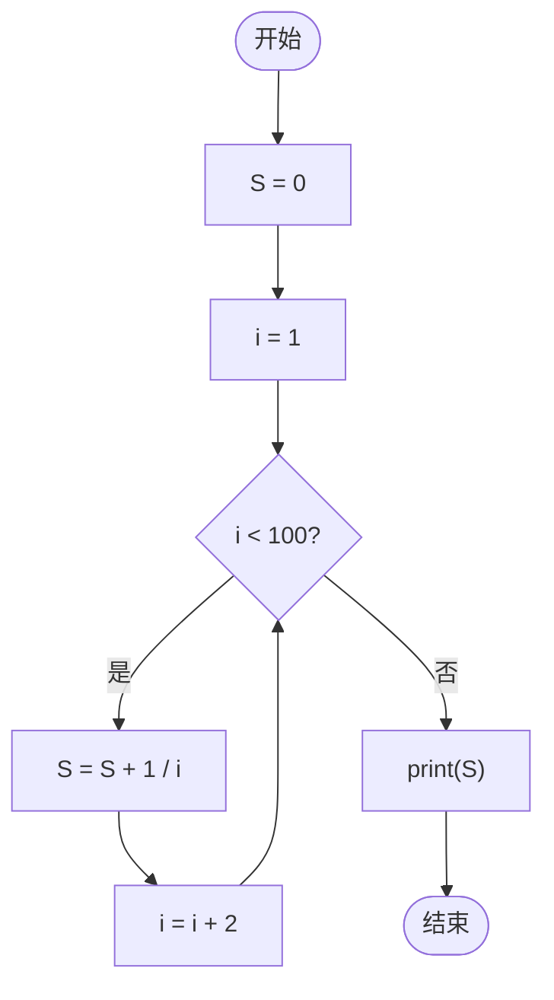

# 计算奇数倒数和
**题目要求:**
计算S，S为
$S=\frac{1}{1}+\frac{1}{3}+\frac{1}{5}.....+\frac{1}{99}$
## 题目要求分析
题目要计算奇数的倒数和，既然要做这么多次加法，那我们就要用到循环`while`
如何表达 $\frac{1}{n}$ 呢？用`1/n`（即1除于n）来表达就行啦~
并且我们知道了**n不会大于等于100**（即while循环的终止条件）
## While循环解法
那么我们就可以得出：
```python
n=1#从1/1开始
S=0# 用于存储倒数之和
while n<100:#当n小于100时循环执行
    S=S+1/n#S加上目前的1/n
    n=n+2#让n每次循环+2，即1，3，5，7，9....99
print(S)
```
### 流程图：

## For循环解法（进阶）
```python
S=0#初始化S
for i in range(1,100,2):#历遍1-99，步长为2
    S+=1/i
print(S)
```
### 流程图：

>[!TIP]
有没有发现while循环与for循环除了变量名不一样结构完全一样？Bingo！在结构上二者的循环是完全一样的（即等价），只是写法不同和简易难度不同罢了
>