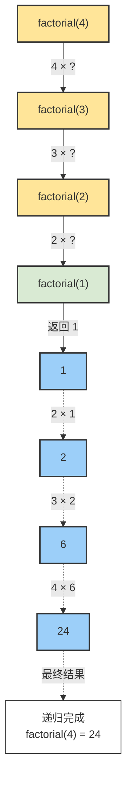

# Python递归思想
## 递归是一种编程技术，函数通过调用自身来解决问题。它通常包含基准条件（终止递归）和递归条件（继续调用自身）。
>[!TIP]
建议了解def函数后再来学习递归内容
>

## 什么是递归？
把一个大问题拆解成结构相同但规模更小的子问题，直到触及一个可以直接回答的边界条件（基准情形）。
简单来说：
* 递归就像查一个词的解释，发现解释里又有一个不认识的词，于是又去查那个词，直到找到一个不需要查其他词就能懂的解释为止。
## 二、递归三要素
1. 基准条件（Base Case）
递归的"紧急出口"。当问题简化到最简形式时，直接返回结果而不再自我调用。
```python
def factorial(n: int) -> int:
    # 基准条件：最小子问题，已知答案
    if n <= 1:
        return 1  # 0! = 1, 1! = 1
```
**关键点**：基准条件必须可达，否则会导致无限递归和溢出。
2. 递归条件（Recursive Case）
   将问题分解为更小的同类子问题，并向其委托求解。
```python
def factorial(n: int) -> int:
    if n <= 1:
        return 1
    
    # 递归条件：缩小问题规模，委托给factorial(n-1)
    return n * factorial(n - 1)
```
3. 回归过程（Unwinding）
   子问题解决后，逐层返回并组合结果，最终得到原问题的答案。
```python
# 以 factorial(4) 为例的回归过程演示
factorial(4)  # 返回 4 * factorial(3)
└── factorial(3)  # 返回 3 * factorial(2)
    └── factorial(2)  # 返回 2 * factorial(1)
        └── factorial(1)  # 基准：返回 1
        # 开始回归：
        └── 返回 2 * 1 = 2
    └── 返回 3 * 2 = 6
└── 返回 4 * 6 = 24  # 最终结果
```
### 演示
一个简单的小栗子：
```python
def countdown(n):
    # 1. 停止条件（到家了，不用再走了）
    if n == 0:
        print("时间到！")
        return
    
    # 2. 先做事（输出当前数字）
    print(n)
    
    # 3. 然后让下一个同学继续（调用自己）
    countdown(n - 1)

countdown(3)# 调用：countdown(3)
```
**执行过程就像传包裹**：
`countdown(3) → 打印3 → countdown(2) → 打印2 → countdown(1) → 打印1 → countdown(0) → 打印"时间到！" → 结束
`
**核心就两个规矩**
1. 必须有个终点（比如 n == 0），否则会永远进行下去
2. 每次都要更接近终点（比如 n-1），否则到不了终点

### 递归 vs 循环：如何选择？
哎这时候发现，这递归怎么跟循环这么像啊,没错，递归确实能换成循环，两者都能“重复做事”，但思路相反
| 对比点        | 循环               | 递归             |
| ---------- | ---------------- | -------------- |
| **方向感**    | 从前到后一口气跑完        | 先一路到底，再原路返回    |
| **暂存中间结果** | 用**变量**（如 `sum`） | 用**调用栈**（系统自动） |
| **直观程度**   | 简单数数时更直接         | 拆套娃问题时更直观      |
| **溢出风险**   | 几乎无              | 层数太深会栈溢出       |
**对比**
```python
total = 0
for i in range(1, 6):   # 1 2 3 4 5
    total += i
print(total)            # 15
```
```python
def total(n):
    if n == 1:          # 最小娃
        return 1
    return n + total(n-1)  # 先问下层，再回头加

print(total(5))         # 15
```
**适合用递归的场景：**
- 树形/图形结构遍历（文件目录、组织架构）
- 分治算法（快速排序、归并排序）
- 回溯问题（八皇后、迷宫求解）

**不适合递归的场景：**
- 简单重复操作（用循环更高效）
- 深度不可预测的大数据（易栈溢出）
- Python中的性能敏感场景（无尾递归优化）
>[!NOTE]
一句话区分
循环像爬楼梯，一步步数台阶；递归像剥洋葱，剥到芯再把眼泪一层层带回来。
所以：能互相替代，但谁好读写、谁好维护就选谁。
>
**原理拆分**
1. 递进（往下套娃）
每次调用自己时，问题变小一点，就像拆开一层俄罗斯套娃
1. 基准（最小的娃）
当问题小到不能再拆时，直接给出答案（最小的娃里没别的娃了）
1. 回归（回头组合答案）
拿到最小答案后，一层层往回拼，最终得到大答案

### 最终原理流程图展示
```python
def factorial(n):
    if n == 1: return 1  # 基准：最小的娃
    return n * factorial(n-1)  # 套娃
```

##  经典案例介绍
**斐波那契数列**
说到递归思想，总是离不开*斐波那契数列*
*斐波那契数列（Fibonacci sequence）*，又称黄金分割数列，是一个在数学和自然界中广泛出现的数列。这个数列由意大利数学家列奥纳多·斐波那契（Leonardo Fibonacci）在1202年提出，因此得名。
**定义**
斐波那契数列的定义如下：
* F(0) = 0
* F(1) = 1
* F(n) = F(n-1) + F(n-2)，对于 n ≥ 2

**数列的前几项**
根据上述定义，斐波那契数列的前几项是：
0, 1, 1, 2, 3, 5, 8, 13, 21, 34, 55, 89, 144, ...
简单来说，就是：
从 0 和 1 开始，后面的每个数，都是前两个数相加。
数列：
0, 1, 1, 2, 3, 5, 8, 13, 21, 34...

所以，这里就很适合用递归思想了
于是，我们可以得出：
```python
def fib(n):
    """返回第 n 个斐波那契数，从 0 开始计数。"""
    if n < 2:          # ① 最最简单的情况
        return n
    return fib(n-1) + fib(n-2)  # ② 自己调用自己 → 这就是“递归”

# 测试
for i in range(8):
    print(f'fib({i}) = {fib(i)}')
```
运行结果
```
fib(0) = 0
fib(1) = 1
fib(2) = 1
fib(3) = 2
fib(4) = 3
fib(5) = 5
fib(6) = 8
fib(7) = 13
```
| 口诀    | 对应代码                  | 斐波那契例子            |
| ----- | --------------------- | ----------------- |
| **停** | `if n < 2: return n`  | 0 和 1 已经最简单，直接给答案 |
| **拆** | `fib(n-1) + fib(n-2)` | 把大问题拆成两个“小一号”的问题  |
| **信** | 放心地让 `fib()` 自己去算     | 相信“别人”能把小问题的答案算对  |

## 总结
**核心本质**
递归不是循环，而是**信任的委托链**：
"我（n层）不知道完整答案，但我知道n-1层会算，我只需要在他结果上+1就行"
每一层只做两件事：
* 判断："是不是最小的问题了？"（基准检查）
* 委托："不是？那我处理一点点，剩下的交给下一层"
为什么必须回头？
因为下一层的答案依赖于更下一层，必须等到最底层答案返回后，上一层才能计算出结果。就像你不能在拿到子结果前就拼出最终结果。
**一句话原理：递归 = 往下问到头，往上答回来。**